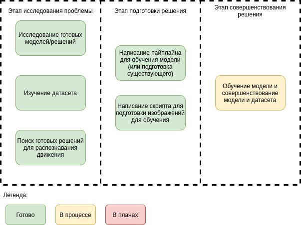

# Image_Segmentation

Статус на данный момент:

Ведется написание собственного модуля подготовки изображений для модели.

# To Do

0) Подумать над модернизацией преобразования изображений перед обучением

1) Добавить функцию наложения сегментированного изображение на исходное для наглядного анализа

2) Добавить автосохранение модели

3) Сделать небольшой блокнот для работы с датасетом

4) Оформить инструкцию по развертыванию кода

5) Форкнуть библиотеку "motion_detection" и переписать setup.py для возможности человеческой установки

# Здесь !будет! инструкция

virtualenv --no-site-packages --python=python3 ImageSegmentation

source ./ImageSegmentation/bin/activate

pip3 install -r requirements.txt

python3 CVtest.py -i ./tmp/video.mov -a ./tmp/annotations.txt -p ./tmp/test/image -m ./tmp/label/image
